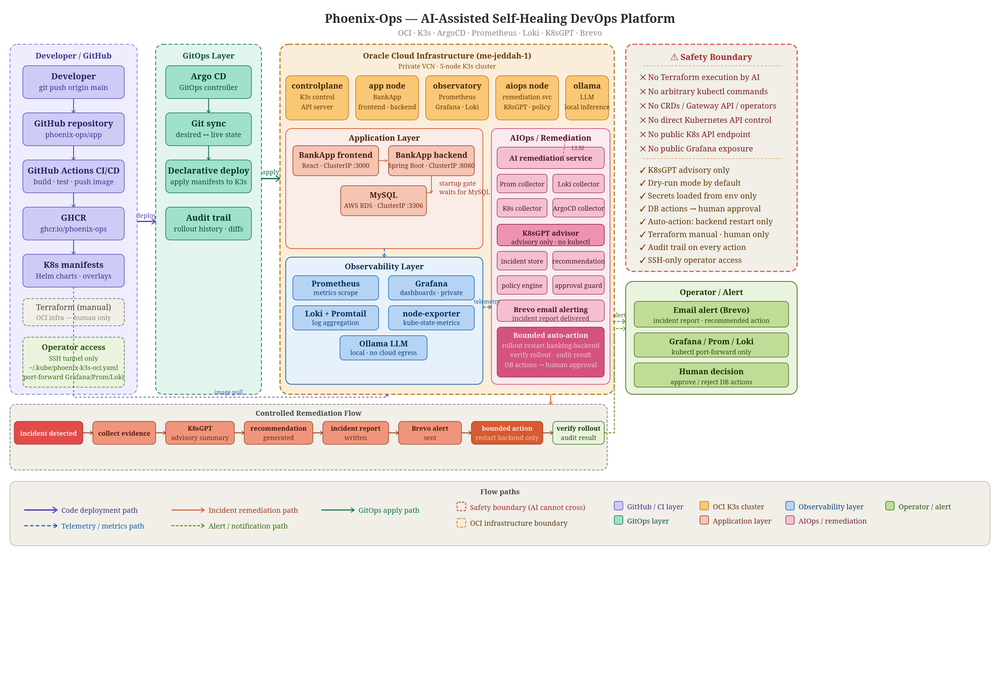
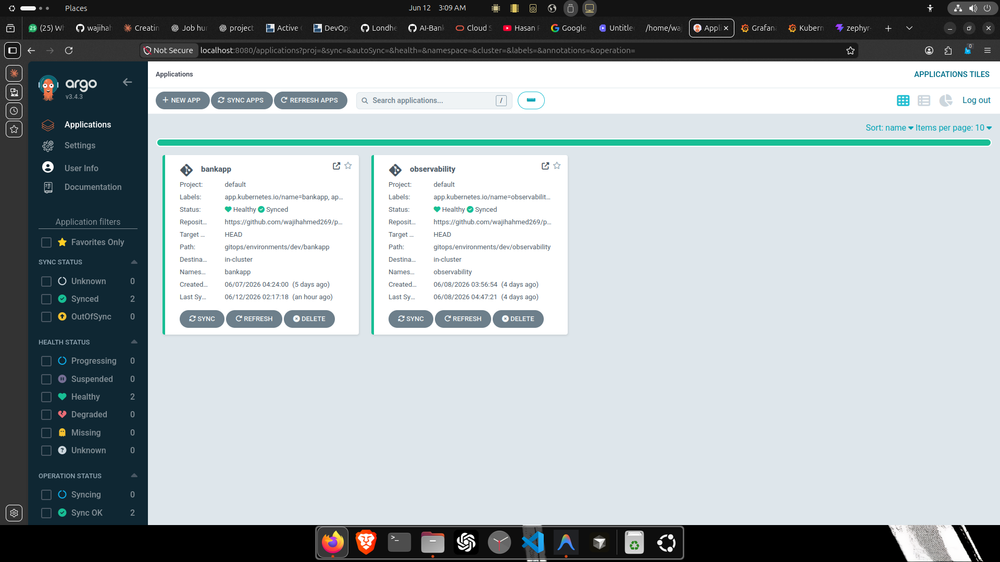
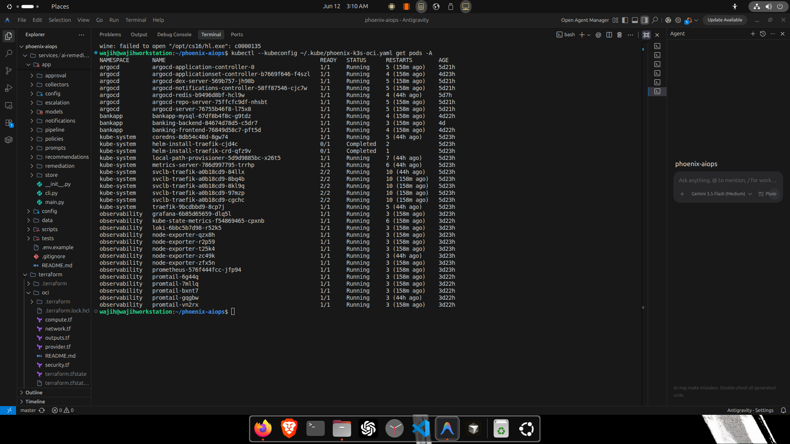
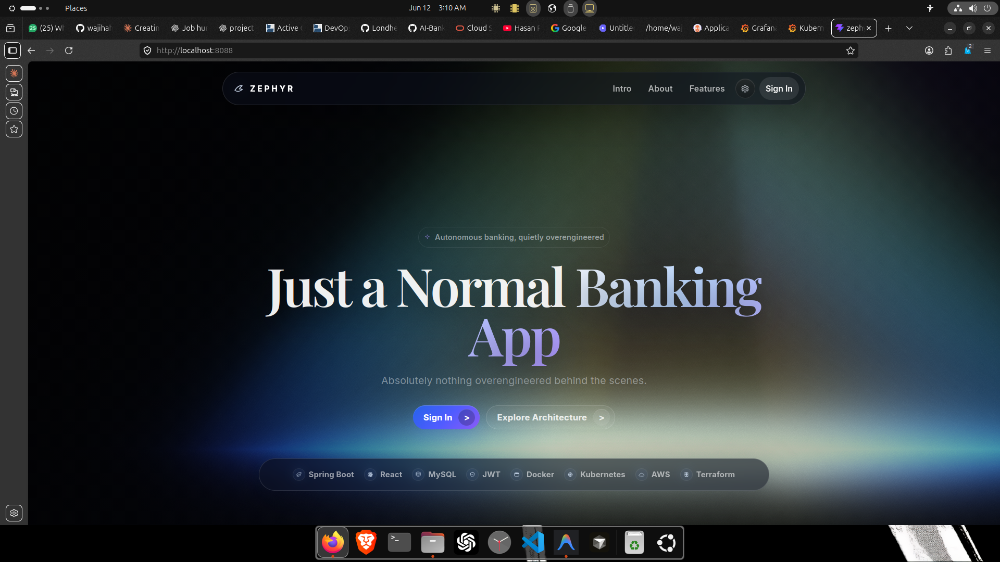

# Phoenix-Ops

<p align="center">
  
  
  
  
  
  
  
</p>

## AI-Assisted AIOps / Self-Healing DevOps Platform

Phoenix-Ops is a cloud-native AIOps platform built to detect, investigate, document, and safely remediate operational issues in Kubernetes environments. It brings together observability, incident correlation, AI-assisted diagnostics, governed remediation workflows, and GitOps practices into a single cohesive operational system.

Most monitoring stacks stop at the alert. Phoenix-Ops doesn't. The platform is built around the idea that faster detection and recovery require more than a notification — they require automated evidence collection, structured incident analysis, actionable recommendations, and controlled remediation that a human operator can trust and approve. Every design decision reflects that goal: reduce mean time to detection (MTTD) and mean time to recovery (MTTR) without sacrificing safety or visibility.

<p align="center">
  
</p>

## Architecture Overview

Phoenix-Ops runs on a private Oracle Cloud Infrastructure (OCI) K3s cluster. The full integration stack includes Kubernetes, Argo CD, Prometheus, Grafana, Loki, K8sGPT, Brevo alerting, and a custom AI Remediation Engine.

The operational flow looks like this:

```
Developer Push → GitHub → GitHub Actions → GitOps Repository → Argo CD
→ K3s Cluster (OCI) → Applications + Observability
→ Phoenix-Ops AIOps Engine → Incident Detection → Evidence Collection
→ K8sGPT Diagnosis → AI Recommendation → Notification / Escalation
→ Operator Approval → Optional Safe Remediation
```

The platform continuously monitors cluster health, correlates signals across sources, generates human-readable incident reports, and produces remediation recommendations — all within a safety-first execution model.

### GitOps Operations

<p align="center">
  
</p>

### Observability Dashboard

<p align="center">
  
</p>

## Key Features

### Observability Stack

The observability layer collects data from every relevant signal source: Prometheus handles metrics, Grafana surfaces dashboards, Loki centralizes logs, and Kubernetes events and Argo CD state are tracked continuously. Nothing important flies under the radar.

### AI-Assisted Incident Analysis

When an incident is detected, Phoenix-Ops pulls evidence from multiple layers simultaneously: the Kubernetes API, pod events, deployment status, Loki logs, Prometheus metrics, Argo CD health data, and K8sGPT diagnostic output. All of these signals are normalized into a single incident record and converted into a plain-language operational report that an engineer can actually read and act on.

#### Example Incident Analysis

<p align="center">
  
</p>

### Incident Artifacts

Every incident automatically generates a complete audit trail. No post-incident scramble to reconstruct what happened.

```
incident-artifacts/
├── evidence.json
├── timeline.md
├── summary.md
├── recommendation.json
├── notifications.log
└── k8sgpt.json
```

The artifact set covers the full incident lifecycle: raw evidence, a human-readable timeline, a summary report, structured recommendations, notification history, and K8sGPT findings.

### K8sGPT Advisory Integration

Phoenix-Ops uses K8sGPT strictly as a diagnostic advisor. It reads cluster state, analyzes Kubernetes failures, and provides plain-English explanations that feed into the incident record. K8sGPT does not modify resources, execute commands, or make remediation decisions. Its role is evidence, not action.

### Notification and Escalation

Alert delivery is handled through Brevo, with a tiered notification workflow that keeps operators informed as the incident develops.

At T+0, the incident is detected and an initial notification goes out. By T+1 minute, evidence collection and K8sGPT diagnostics are complete and an incident summary is generated. At T+5 minutes, the timeline is updated and recommendations are refined. Between T+10 and T+15 minutes, an escalation notification is generated and the optional remediation workflow is evaluated.

### Governed Remediation

Remediation in Phoenix-Ops follows a strict safety-first model. The AI never invents actions. Every possible remediation comes from a predefined catalog that includes options like restarting a deployment, restarting a failed pod, pausing a rollout, reverting a revision, or cordoning a node. Nothing outside that catalog can be executed.

Every remediation candidate passes through policy validation, blast-radius checks, an approval workflow, execution guardrails, and recovery verification before anything touches the cluster.

## Safe Backend Recovery

Phoenix-Ops includes a bounded backend recovery workflow that illustrates how the full remediation loop works in practice.

Consider a scenario where a backend service starts failing readiness checks. The evidence collector picks up readiness probe failures, an increasing restart count, and database timeout errors. K8sGPT diagnoses the issue as dependency readiness instability. The platform generates a recommendation to restart the backend deployment, captures a snapshot, records the recommendation, sends a notification, and requests operator approval. Nothing executes until that approval is explicitly granted.

## Security Model

Phoenix-Ops follows a failure-closed design. Every principle in the platform reflects that posture: AI is advisory, approvals are scoped, actions are audited, evidence is preserved, and execution is controlled.

A set of operations is unconditionally forbidden and cannot be triggered through any workflow: `terraform apply`, `terraform destroy`, namespace deletion, PVC deletion, RBAC escalation, and public exposure changes. These are hard limits, not configurable guardrails.

## Technology Stack

**Platform:** Kubernetes (K3s), Oracle Cloud Infrastructure, Argo CD, GitHub Actions

**Observability:** Prometheus, Grafana, Loki

**AIOps:** Python, K8sGPT, Incident Correlation Engine, Recommendation Engine, Approval Workflow

**Alerting:** Brevo

## Repository Structure

```
phoenix-aiops/
├── docs/
├── gitops/
├── scripts/
├── services/
│   └── ai-remediation/
├── incident-artifacts/
└── README.md
```

## Validation Coverage

The platform includes automated validation for the K8sGPT advisory integration, notification flow, remediation guardrails, execution simulation, backend restart policy, approval workflow, verification engine, and incident artifact generation.

Current status: 45 automated tests passing, Argo CD synced, observability healthy, AIOps workflow validated.

## Roadmap

Planned future work includes multi-cluster support, advanced incident correlation, an expanded remediation catalog, Prometheus-based recovery verification, additional notification providers, and enhanced operational dashboards.

Some things are intentionally out of scope for the current version: Gateway API, custom CRDs, the K8sGPT Operator, autonomous infrastructure changes, and unbounded AI execution. These exclusions are deliberate — the platform is designed to keep a human in the loop.

## Project Goals

Phoenix-Ops was built to explore how modern platform engineering, observability, GitOps, and AI-assisted operations can work together safely in production-style environments.

The goal was never fully autonomous infrastructure. It was faster diagnosis, better operational visibility, safer remediation, and stronger reliability engineering practices — the kind of system that makes on-call less painful and incidents less mysterious.
